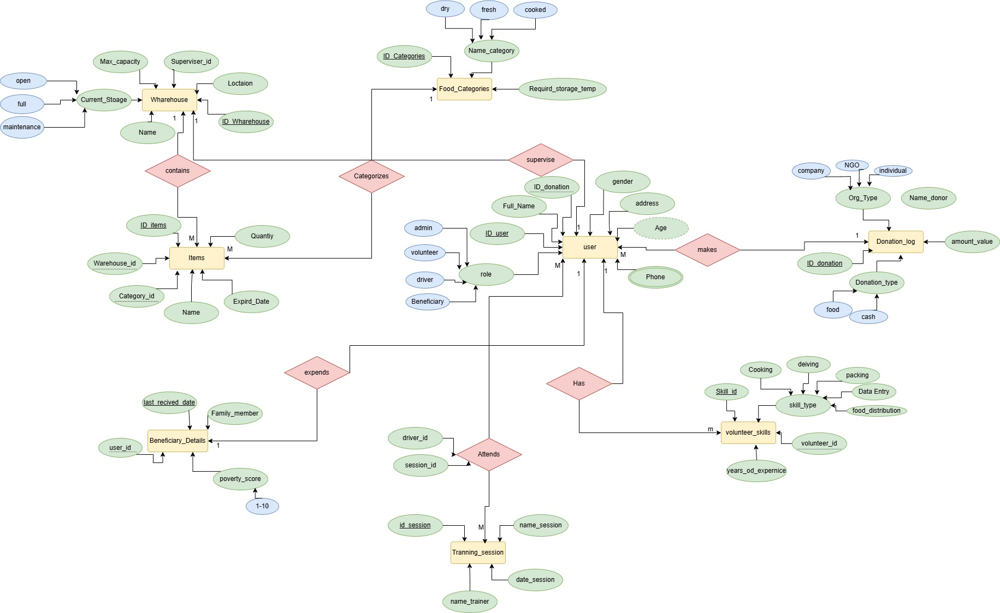

#  Ramadan Food Distribution Database

##  Project Overview
This project is a MySQL database designed to manage Ramadan food distribution operations.

The system helps organizations manage:

- Warehouses
- Food inventory
- Donations
- Volunteers
- Drivers
- Beneficiaries
- Training sessions

The database ensures fair food distribution and proper inventory tracking.

---

##  Database Name

ramadadan_distributions

---

##  Main Tables

The system includes the following tables:

- warehouses
- food_categories
- inventory_items
- donations_log
- User_Master
- beneficiary_details
- training_sessions
- driver_training
- volunteer_skills

---

##  Triggers

The database includes triggers to enforce important rules:

1. Prevent shipping expired food items  
2. Prevent storing dry food that expires within 3 days  
3. Prevent beneficiaries from receiving food more than once within 15 days

---

##  Example Queries

The project includes several SQL queries such as:

- Finding food items close to expiration
- Tracking donations by organization type
- Listing volunteers and their skills
- Finding drivers who haven't completed safety training
- Identifying families with high poverty scores

---

##  ERD Diagram

The following diagram represents the database design.



---

## How to Run the Project

1. Install MySQL
2. Create the database

```
CREATE DATABASE ramadadan_distributions;
```

3. Import the SQL file

```
Ramadan_Distributions.sql
```

4. Run the test queries from

```
TEST.SQL
```

---

## 🛠 Technologies Used

- MySQL
- Relational Database Design
- ERD Modeling

---

## 👥 Team Members
 -Ail Houseny
 - Nada mostafa

